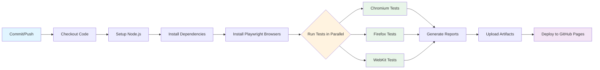

# CI/CD Pipeline Visualization

## Overview

This document provides a comprehensive visualization of our automated CI/CD pipeline for continuous testing and deployment. The pipeline ensures code quality through automated testing across multiple browsers and devices.

## Pipeline Flow

## Key Features

### 1. **Parallel Test Execution**
- Tests run simultaneously across multiple browsers
- Significantly reduces total execution time
- Provides comprehensive browser compatibility coverage

### 2. **Automatic Retry Mechanism**
- Flaky tests are automatically retried
- Reduces false positives
- Improves pipeline reliability

### 3. **Artifact Storage**
- Test reports stored as artifacts
- Screenshots and traces preserved for debugging
- Accessible for 30 days after test execution

### 4. **Multi-Browser Coverage**
- **Chromium**: Chrome, Edge, and Chromium-based browsers
- **Firefox**: Mozilla Firefox
- **WebKit**: Safari and WebKit-based browsers

### 5. **Automated Deployment**
- Successful tests trigger GitHub Pages deployment
- Documentation and demo site automatically updated
- Zero-downtime deployments

## Pipeline Stages

### Stage 1: Checkout Code
- Retrieves latest code from repository
- Sets up Git configuration
- Ensures working directory is clean

### Stage 2: Setup Environment
- Installs Node.js runtime
- Configures npm caching for faster builds
- Sets up environment variables

### Stage 3: Install Dependencies
- Runs `npm install` to install project dependencies
- Uses lock file for reproducible builds
- Caches node_modules for faster subsequent runs

### Stage 4: Install Browsers
- Downloads and installs Playwright browsers
- Installs OS-level dependencies
- Configures browser binaries

### Stage 5: Execute Tests
- Runs Playwright test suite
- Executes tests in parallel across browsers
- Generates screenshots and traces on failure
- Retries flaky tests automatically

### Stage 6: Generate Reports
- Creates HTML test reports
- Compiles test statistics
- Formats results for stakeholder consumption

### Stage 7: Upload Artifacts
- Stores test reports as artifacts
- Preserves screenshots and traces
- Makes results downloadable from Actions tab

### Stage 8: Deploy to Pages
- Builds documentation site
- Deploys to GitHub Pages
- Updates live demo application

## Continuous Improvement

### Monitoring & Metrics
- Test execution times tracked
- Failure rates monitored
- Flaky test detection

### Quality Gates
- All tests must pass before merge
- Coverage thresholds enforced
- Accessibility checks required

## Benefits

✅ **Fast Feedback** - Results available within minutes  
✅ **Comprehensive Coverage** - Multi-browser, multi-device testing  
✅ **Reliable** - Automatic retries reduce false failures  
✅ **Transparent** - Full visibility into test results  
✅ **Automated** - No manual intervention required  
✅ **Scalable** - Easily add more tests and browsers  

## Related Documentation

- [Main README](../README.md) - Project overview
- [Test Plan](test-plan.md) - Testing strategy
- [Architecture](architecture.md) - System design

---

**Last Updated**: 2024  
**Pipeline Version**: 1.0
